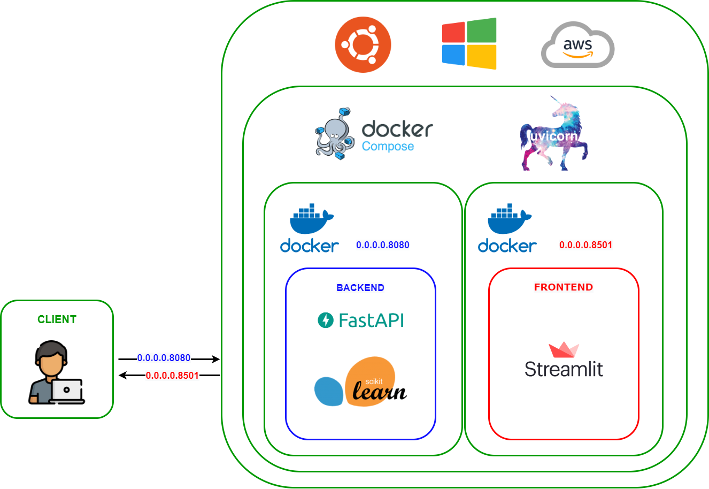

[](https://zenodo.org/doi/10.5281/zenodo.12507163)

<h1 align="center">Diet Recommendation System</h1>

## :scroll: General info

  <h4>A diet recommendation web application using content-based approach with Scikit-Learn, FastAPI and Streamlit.</h4>
<h4>A full-stack web application that recommends personalized food & diet plans based on your **nutrition goals** and **ingredients**.  
Built with **FastAPI** (backend) + **Streamlit** (frontend) + **Scikit-Learn** (ML model).</h4>

---

## 🌍 Live Deployment : https://rajani-diet.onrender.com/

---

### Model developement
The recommendation engine is built using Nearest Neighbors alogrithm which is an unsupervised learner for implementing neighbor searches. It acts as a uniform interface to three different nearest neighbors algorithms: BallTree, KDTree, and a brute-force algorithm based on routines in sklearn.metrics.pairwise. For our case, we used the brute-force algorithm using cosine similarity due to its fast computation for small datasets.

$$cos(theta) = (A * B) / (||A|| * ||B||)$$

### Dataset
I used Food.com kaggle dataset Data with over 500,000 recipes and 1,400,000 reviews from Food.com. Visit this [kaggle](https://www.kaggle.com/datasets/irkaal/foodcom-recipes-and-reviews?select=recipes.csv) link for more details.

### Deployement using Docker
#### Why Docker?
By using Docker, you can ensure that the environment in which the application is exactly the same as the environment in which it was built, which can help prevent unexpected issues and improve model performance. Additionally, Docker allows for easy scaling and management of the deployment, making it a great choice for larger machine learning projects.

### Project Architecture

<div align= "center"></div>


## :rocket: Technologies
The project is created with:
* Python: 3.10.8
* fastapi 0.88.0
* uvicorn 0.20.0
* scikit-learn 1.1.3
* Pandas: 1.5.1
* Streamlit: 1.16.0
* streamlit-echarts 1.24.1
* Numpy: 1.21.5
* beautifulsoup4 4.11.1

 

## :whale: Setup

## 🛠️ Tech Stack

| Layer | Technology | Purpose |
|-------|-----------|---------|
| Frontend | Streamlit | Web UI for user input & results |
| Backend | FastAPI | REST API server |
| ML Model | Scikit-Learn (KNN) | Food recommendation engine |
| Data | Pandas + CSV | Food dataset (500k+ recipes) |
| Containerization | Docker | Package & run both services |
| Deployment | Render.com | Cloud hosting |

---


---

## 📌 Pages in the App

### Page 1 — 💪 Diet Recommendation
- Enter your: **age, height, weight, activity level, diet type, meals per day**
- App calculates your daily nutrition needs (BMI, TDEE)
- Returns a **full day meal plan** (breakfast, lunch, dinner, snacks)

### Page 2 — 🔍 Custom Food Recommendation
- Enter specific **ingredients** you have
- Enter desired **nutrition values** manually
- Returns matching **recipes** from the dataset

---

## 📁 Folder Structure

```
Diet-Recommendation-System-main/
│
├── 📂 FastAPI_Backend/                         ← Backend (API Server)
│   ├── main.py                                 ← API routes & data loading
│   ├── model.py                                ← ML recommendation logic
│   ├── requirements.txt                        ← Backend Python dependencies
│   ├── Dockerfile                              ← Docker setup for backend
│   └── .dockerignore                           ← Files excluded from Docker build
│
├── 📂 Streamlit_Frontend/                      ← Frontend (User Interface)
│   ├── Hello.py                                ← Home / Welcome page
│   ├── Generate_Recommendations.py             ← Calls backend API & shows results
│   ├── 📂 pages/
│   │   ├── 1_💪_Diet_Recommendation.py         ← Page 1: Diet plan by health goals
│   │   └── 2_🔍_Custom_Food_Recommendation.py  ← Page 2: Search food by ingredients
│   ├── 📂 ImageFinder/                         ← Helper to fetch food images
│   ├── requirements.txt                        ← Frontend Python dependencies
│   ├── Dockerfile                              ← Docker setup for frontend
│   └── .dockerignore                           ← Files excluded from Docker build
│
├── 📂 Data/
│   ├── dataset.csv                             ← Full food dataset (~95 MB, 500k+ recipes)
│   └── dataset_small.csv.gz                   ← Compressed 50k-row dataset (used on Render)
│
├── 📂 Assets/                                  ← Images and static files
├── 📂 Docs/                                    ← Extra documentation
├── 📂 .github/                                 ← GitHub Actions / workflows
│
├── docker-compose.yml                          ← Run both services together locally
├── render.yaml                                 ← Render.com deployment config
├── food-recommendation-system.ipynb            ← Original research Jupyter notebook
├── .gitignore                                  ← Git ignored files
└── README.md                                   ← This file
```

